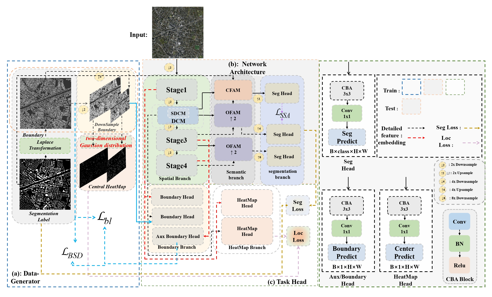

# 🎆SFGNet: Salient feature-guided real-time building extraction network🎆

**This repository contains the official Pytorch implementation of training & evaluation code and the pretrained models for** [[SFGNet]](https://github.com/gasking/SFGNet)🔥

<div align="center">
  
</div>
<p align="center">
  Fig. 1. Architecture diagram of salient feature-guided real-time building extraction network(SFGNet)
</p>


## Abstract:
**Building extraction has continually maintained a crucial role in interpreting remote-sensing images. Nevertheless, the extant building extraction approaches cannot achieve an optimal balance between accuracy and inference speed, failing to fulfill the requisites of high concurrency and real-time response.Recently, researchers have sought to address this issue by decreasing resolution, adding prior information, and using knowledge distillation. Despite these methods enhancing segmentation performance to some extent, they continue to face significant hurdles, such as feature lightweight, adequately articulating salient features, and ensuring semantic cohesion among various characteristics. Consequently, this research presents a novel real-time building extraction network, SFGNet, engineered to thoroughly investigate and integrate salient information, such as semantics, details, and borders, thereby improving segmentation performance. First, an effective feature extraction module, the Dual-branch Cascade Module (DCM), is developed to extract considerable channel information by learning shallow details and boundary features of buildings. Moreover, an Offset Feature Alignment Module (OFAM) is designed to minimize feature offset in both high- and low-frequency connection zones to capture detail and contour edge feature information. A lightweight Context Feature Aggregation Module (CFAM) is subsequently developed in the decoder stage to consolidate local and global features. Finally, a novel hybrid Loss Function has been developed to direct model training in addressing the challenges associated with constructing single-view, high-density, long-tailed object imbalances.} In the two public datasets of Massachusetts Builds and WHU Aerial Image, the mIoU of the proposed SFGNet reached 75.46\% and 89.40\%, with an F1-score of 74.64\% and 89.71\% respectively. The present model has an extremely small 2.397 M of parameters while attaining an FPS of 114.52. The results demonstrated that the proposed model surpasses the current well-known and the latest models, attaining the optimal balance between inference speed and segmentation accuracy, and holds significant application value for real-time building segmentation. The Code is available at https://github.com/gasking/SFGNet.**


## Installation
**We use [Pytorch2.1.1 + CUDA11.8] as  a software configuration environment.**

### Environment Installation
```
conda create -n RTBuild python=3.8
conda activate RTBuild
conda install pytorch torchvision torchaudio cudatoolkit -c pytorch

pip config set global.index_url=https://pypi.tuna.tsinghua.edu.cn/simple/
pip install -r requirements.txt
```

## Dataset 
- **WHU Aerial Image  dataset:** https://drive.google.com/file/d/1QxIpX4JgU_iO5iuEO2j5_pqlOOkOUHy_/view?usp=sharing
- Massachusetts  dataset: https://drive.google.com/file/d/1n5paF9oxByok_2321KxLj8QDkrw8n6iW/view


## Results
### Comparison with the Latest Methods 
**Comparison of various real-time semantic segmentation algorithms on Massachusetts Builds Dataset (retaining BN layers during FPS testing,the optimal results are shown in bold and suboptimal results are shown underline)**

<div align="center">
  
</div>
<p align="center">
</p>

<div align="center">
  
</div>
<p align="center">
</p>


* ***Comparison of various real-time semantic segmentation algorithms on WHU Aerial Image Dataset (retaining BN layers during FPS testing,the optimal results are shown in bold and suboptimal results are shown underline)***

* <div align="center">
    
  </div>
  <p align="center">
  </p>
<div align="center">
  
</div>
<p align="center">
</p>


* ***Loss function ablation experiment (training on dataset WHU Aerial Image Dataset, optimal results are shown in bold)***

* <div align="center">
    
  </div>
  <p align="center">
  </p>
<div align="center">
  
</div>
<p align="center">
</p>


* **Visualization of the results of the module ablation experiment**

* <div align="center">
    
  </div>
  <p align="center">
  </p>
<div align="center">
  
</div>
<p align="center">
</p>


* **Visualization results of ablation experiments for key parameters**

* <div align="center">
    
  </div>
  <p align="center">
  </p>
<div align="center">
  
</div>
<p align="center">
</p>


## License
 The code is released under the MIT license[](https://opensource.org/licenses/MIT).

## Relevant Projects
***[1] SCTNet: Single-Branch CNN with Transformer Semantic Information for Real-Time Segmentation*** [**[arXiv](https://arxiv.org/abs/2312.17071) [code](https://github.com/xzz777/SCTNet/)**]
***[2] PIDNet: A Real-time Semantic Segmentation Network Inspired from PID Controller*** [**[PIDNet](https://arxiv.org/abs/2312.17071) [code](https://github.com/XuJiacong/PIDNet)**]

- ***Thanks for their nice contribution.***

