# 🎆SFGNet: Salient feature-guided real-time building extraction network🎆

**This repository contains the official Pytorch implementation of training & evaluation code and the pretrained models for** [[SFGNet]](https://github.com/gasking/SFGNet)🔥

<div align="center">
  
</div>
<p align="center">
  a) Overall architecture of the proposed SFGNet, consisting of a Data-Generator, Network Architecture, and Task Head; b) the feature interactions between SDCM, OFAM, and CFAM; c) Module component; d) Data flow.
</p>


## Abstract:
**Building extraction is crucial for interpreting remote-sensing images. However, existing methods struggle to balance accuracy with inference speed, limiting their support for high concurrency and real-time processing. Although recent approaches have improved segmentation, significant hurdles remain in feature lightweighting, capturing salient features, and ensuring semantic coherence across different characteristics. This paper presents a salient feature-guided real-time building extraction network (SFGNet), designed to investigate and integrate salient information, such as semantics, details, and borders, thereby improving segmentation performance. First, an effective feature extraction module called Dual-branch Cascade Module (DCM) was developed to extract relevant channel information by learning the shallow details and boundary features of buildings. Additionally, an Offset Feature Alignment Module (OFAM) is designed to minimize the feature offset in both high- and low-frequency connection zones to capture detail and contour edge feature information. A lightweight Context Feature Aggregation Module (CFAM) was implemented in the decoder stage to consolidate local and global features. Finally, a novel hybrid loss function was designed to address the imbalance in single-view, high-density distributions. On the three public datasets (Massachusetts Builds, WHU Aerial Image, and Potsdam Dataset), our model achieves mIoU scores of 75.45%, 89.40%, and 93.16%, respectively. Furthermore, an additional cross-domain experiment on an external untrained real dataset demonstrated outstanding generalization performance. With only 2.397 M parameters, the model reaches an 130.62 FPS, outperforming current state-of-the-art models in terms of both segmentation accuracy and inference speed. These results demonstrate the potential of SFGNet for real-time building segmentation. The Code is available at https://github.com/gasking/SFGNet.**


## Installation
**We use [Pytorch2.1.1 + CUDA11.8] as  a software configuration environment.**

### Environment Installation
```
conda create -n RTBuild python=3.8
conda activate RTBuild
conda install pytorch torchvision torchaudio cudatoolkit -c pytorch

pip config set global.index_url=https://pypi.tuna.tsinghua.edu.cn/simple/
pip install -r requirements.txt
```

## Dataset 
- **WHU Aerial Image  dataset:** https://drive.google.com/file/d/1QxIpX4JgU_iO5iuEO2j5_pqlOOkOUHy_/view?usp=sharing
- **Massachusetts  dataset:** https://drive.google.com/file/d/1n5paF9oxByok_2321KxLj8QDkrw8n6iW/view
- **Potsdam datatset:**
- **CScity dataset:** 


## Results
### Comparison with the Latest Methods 


**Comparison of various real-time semantic segmentation algorithms on Massachusetts Builds Dataset (retaining BN layers during FPS testing, the optimal results are shown in bold and suboptimal results are shown underline)**

<div align="center">
  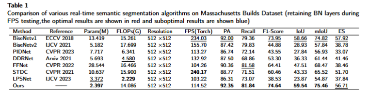
</div>
<p align="center">
</p>

<div align="center">
  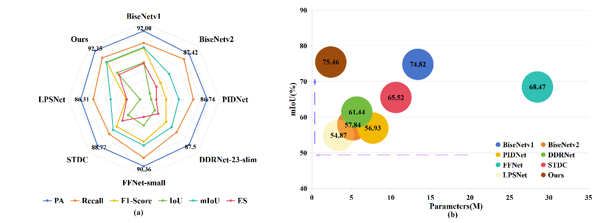
</div>
<p align="center">
  Fig.6 Visualization of Massachusetts Builds Dataset performance. a) Radar chart with lines farther from the center indicating better performance and b) bubble chart with the arrow directions indicating performance.
</p>

<div align="center">
  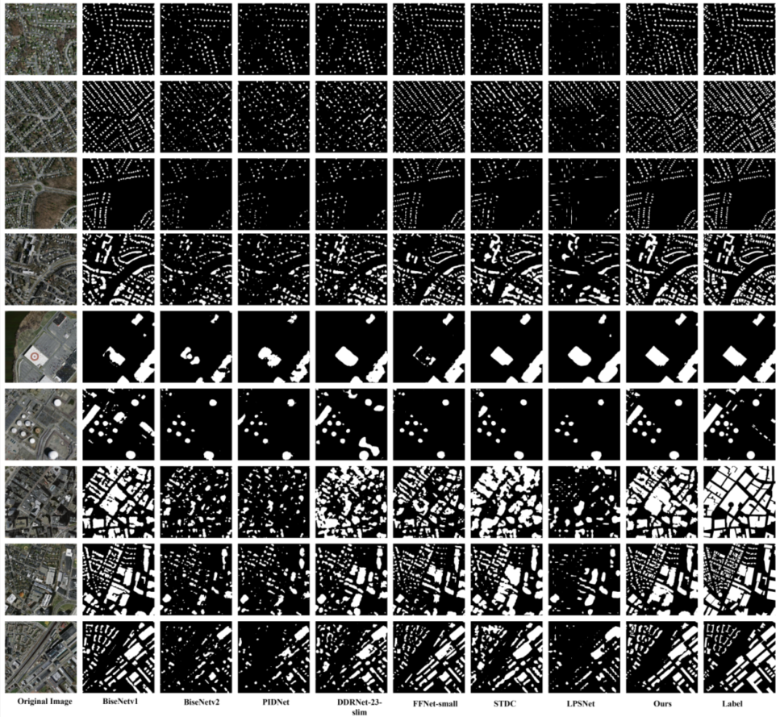
</div>
<p align="center">
</p>

* ***Comparison of various real-time semantic segmentation algorithms on the WHU Aerial Image Dataset (retaining BN layers during FPS testing, the optimal results are shown in bold and suboptimal results are shown underline)***

* <div align="center">
    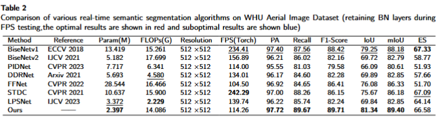
  </div>
  <p align="center">
  </p>
  <div align="center">
    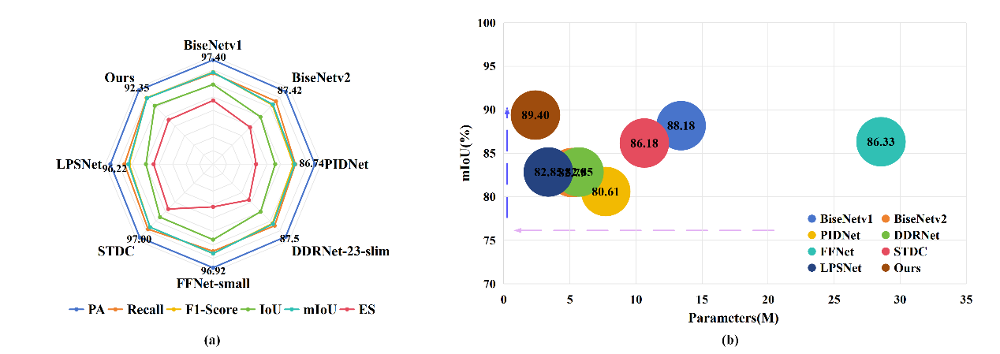
  </div>
  <p align="center">
  </p>
<div align="center">
  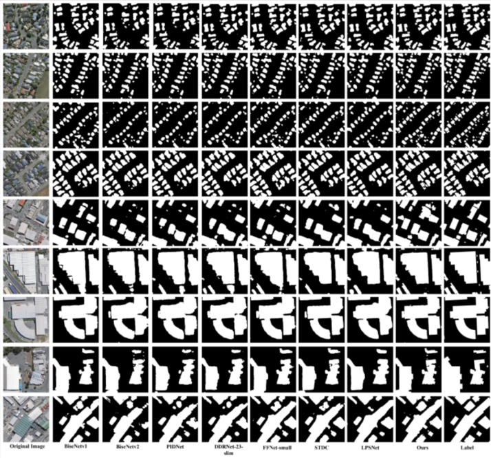
</div>
<p align="center">
</p>

* ***Comparison of various real-time semantic segmentation algorithms on the Potsdam Dataset (retaining BN layers during FPS testing,the optimal results are shown in bold and suboptimal results are shown underline)***

* <div align="center">
    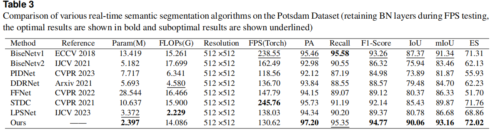
  </div>
  <p align="center">
  </p>

<div align="center">
    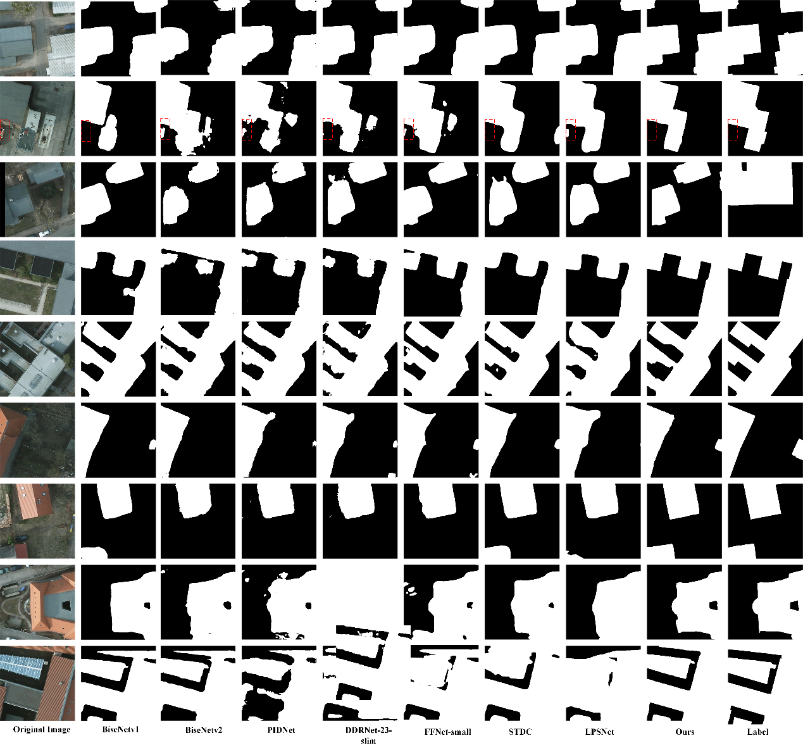
  </div>
  <p align="center">
  </p>
  
<div align="center">
  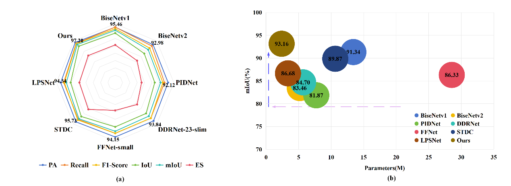
</div>
<p align="center">
</p>

### Cross-domain Building Detection for Generalization Performance Analysis
* ***Qualitative analysis of direct cross-domain building detection with multiple models*** 
<div align="center">
  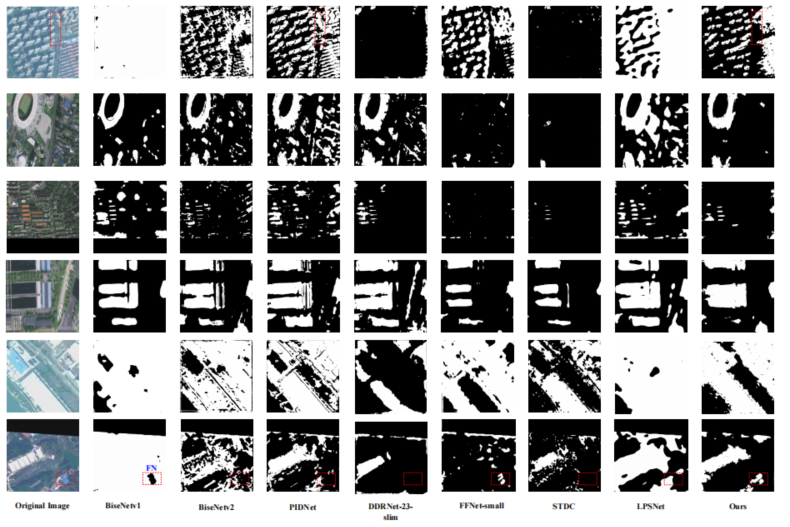
</div>
<p align="center">
 Fig. 10 Cross-domain building detection (Massachusetts → CScity) visualization results
</p>


* ***Cross-domain building detection feature response analysis across various models***

<div align="center">
  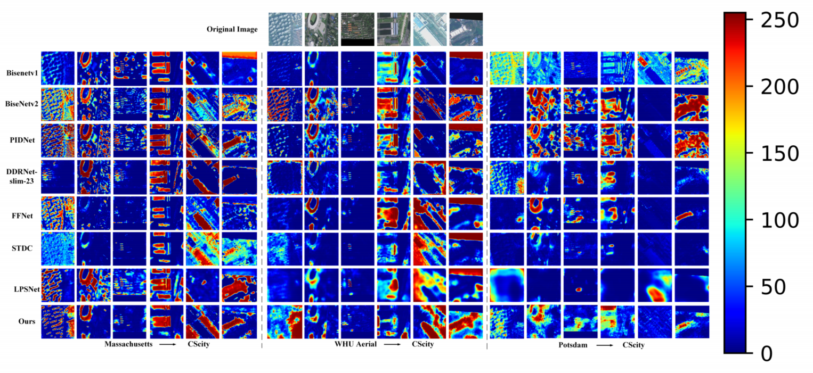
</div>
<p align="center">
  Fig. 11 Cross-domain building detection feature response visualization across multiple datasets.
</p>

<div align="center">
  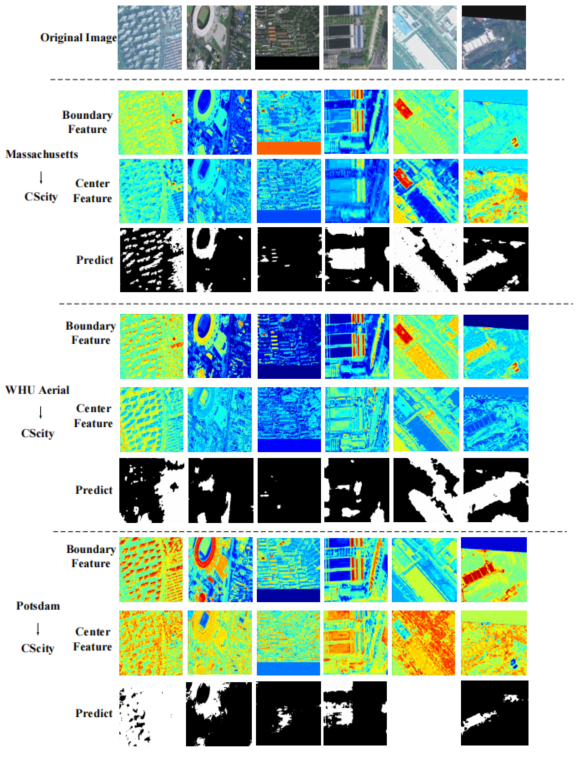
</div>
<p align="center">
  Fig.12 Cross-domain building detection feature visualization results of our method across multiple datasets.
</p> 

## Ablation Studies
* ***Loss function ablation experiment (training on dataset WHU Aerial Image Dataset, optimal results are shown in bold)***

* <div align="center">
    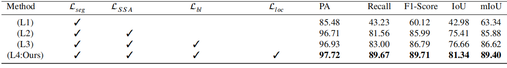
  </div>
  <p align="center">
  </p>
<div align="center">
  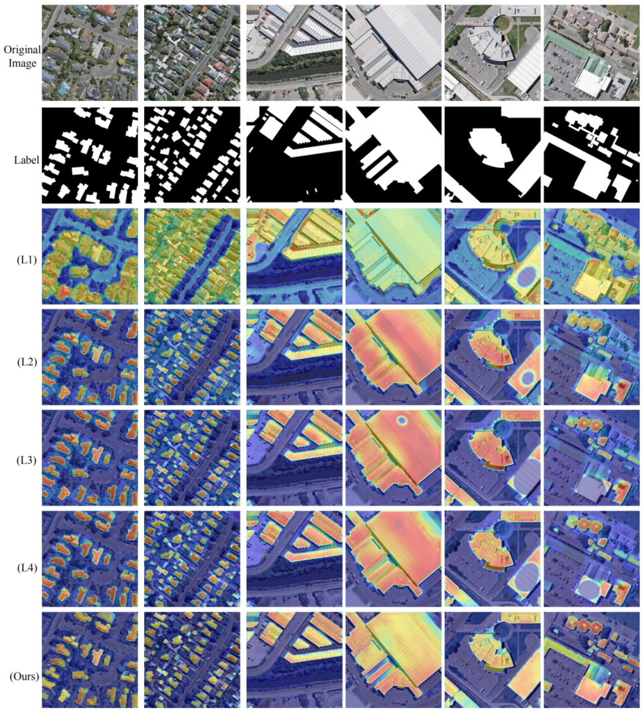
</div>
<p align="center">
</p>


* **Visualization of the results of the module ablation experiment**

* <div align="center">
    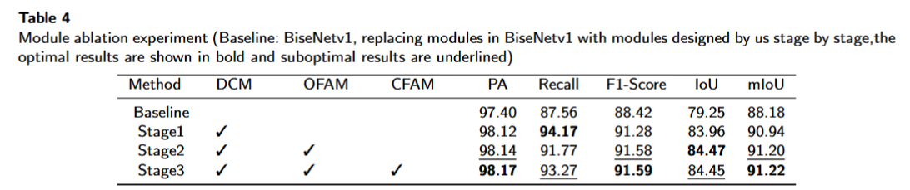
  </div>
  <p align="center">
  </p>
<div align="center">
  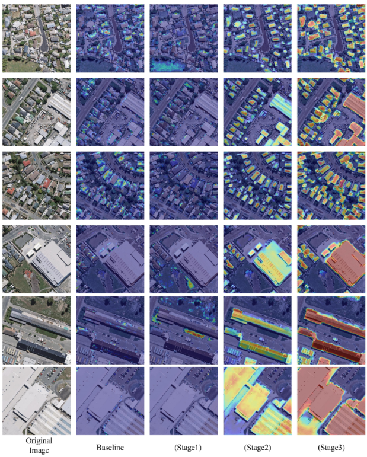
</div>
<p align="center">
</p>
  

* **Visualization results of ablation experiments for key parameters**

* <div align="center">
    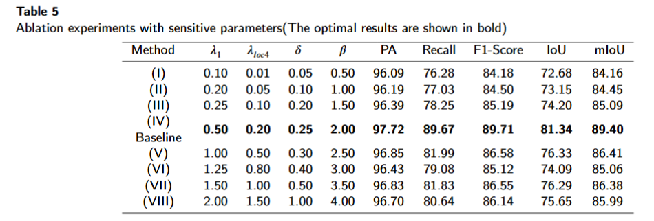
  </div>
  <p align="center">
  </p>
<div align="center">
  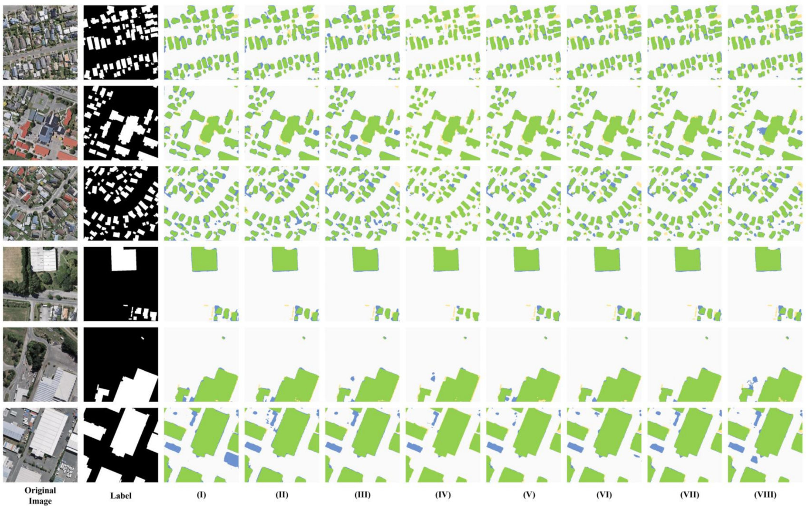
</div>
<p align="center">
</p>


## License
 The code is released under the MIT license[](https://opensource.org/licenses/MIT).

## Relevant Projects
***[1] SCTNet: Single-Branch CNN with Transformer Semantic Information for Real-Time Segmentation*** [**[arXiv](https://arxiv.org/abs/2312.17071) [code](https://github.com/xzz777/SCTNet/)**]
***[2] PIDNet: A Real-time Semantic Segmentation Network Inspired from PID Controller*** [**[PIDNet](https://arxiv.org/abs/2312.17071) [code](https://github.com/XuJiacong/PIDNet)**]

- ***Thanks for their nice contribution.***

